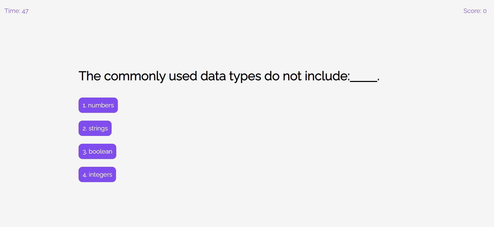

# Timed-Quiz

Module 4 challenge of making a timed quiz with javascript.

## Description

- The quiz is made to render different JavaScript related questions to test a user's knowledge.

- More questions with various degrees of difficulties will be added in the future.

* The user will be greeted with a welcome page when first launching the application.

* Once the user hits the 'start game' button, the first question will be rendered and the time starts counting down.

* For now, the timer is set to be 50 seconds.

* Five seconds will be deducted from the timer each time a user answers a question wrong.

* 2 points will be added to the score if a right choice is made and 1 point will be taken away if a wrong choice is made.

* After the user makes a selection for his/her answer, a message will pop up to indicate whether or not the user got the correct answer.

* The game is over when time is up, or when the user finishes all question. The user will then be taken to a page which shows the final score for this round of game, as well as an input field where the user may enter his/her initials.

* The user can store his/her score and initials to the high scores list by clicking on the 'submit' button.

* The user will be taken to the high scores page where a list of history of scores and names will be displayed. The user may also visit these information before the start of the game by clicking 'view high scores' on the top left corner. Note that once the game is started, the high scores page will be unavailable.

* The user may choose to go back to the welcome page by clicking on the 'go back' button in the high scores page. The user may also erase all scores history by clicking 'clear scores'.

## Usage

- When the application is launched, the user will see this:

  

  click the 'start game' button to begin. Users can also click 'view high scores' to review scores history.

- After clicking the "Start Game" button, the game stars and the first question will appear:

  

- After making a selection, a message will pop up telling the user their choice is correct/incorrect:

  

- After the time is up, or the user finishes all questions, it will jump to the final score page:

  

  Once the submit button is clicked, the score and the initials will be stored and displayed in the view high scores page.

- This is what the high scores page looks like:

  

  The user may click on 'go back' to restart the game or click on 'clear scores' to clear all history.
